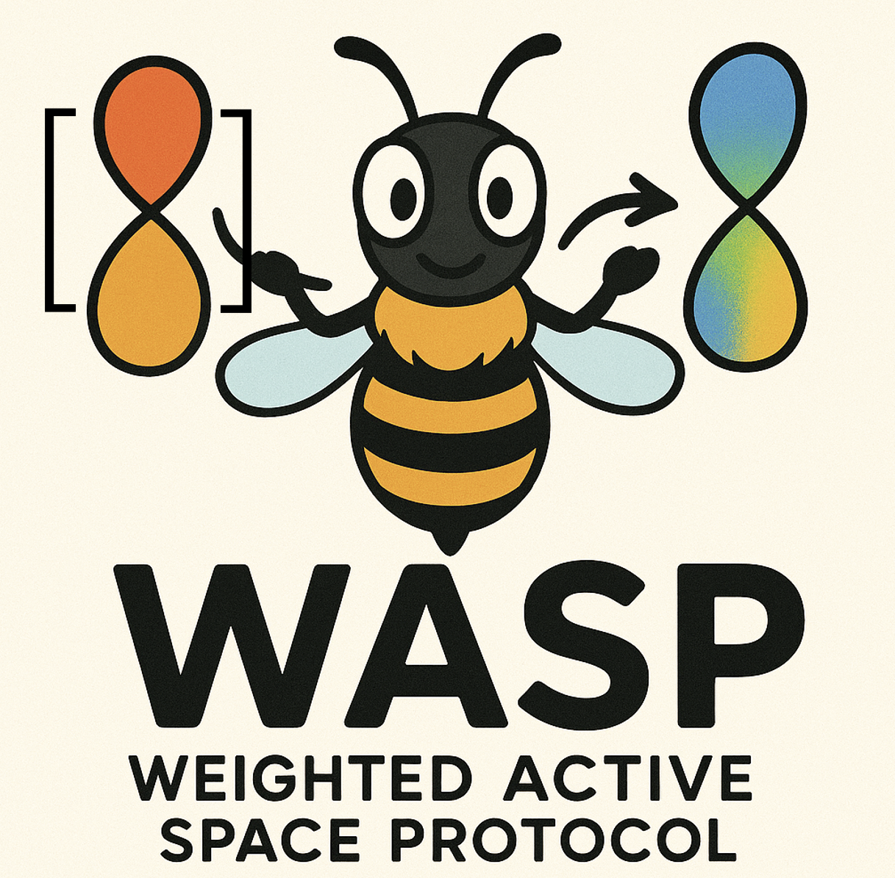

<p align="left">
  
</p>

# WASP: Weighted Active Space Protocol

**WASP** (Weighted Active Space Protocol) is a Python framework designed to generate molecular orbital (MO) coefficient guesses through interpolation from a reference library of wave function checkpoints.

## 📚 Requirements

To use WASP, you'll need the following Python packages:

```bash
pip install pyscf ase
```
## ▶️ Quick Start

To run the example and see WASP in action:

```bash
python examples/run_example.py
```

This script will:

- Load a set of checkpoint geometries and their MO coefficient files (`.hdf5`)
- Read a target geometry from an `.xyz` file
- Compute RMSDs between the target and checkpoint geometries
- Interpolate a guess MO coefficient matrix using normalized inverse-distance weights
- Run a MCPDFT calculation on the target geometry using orthonormalized guess MO coefficient matrix

## 📜 Citation

If you use **WASP** in your research or publications, please cite the following:

```bibtex
@article{seal2025weighted,
  title={Weighted active space protocol for multireference machine-learned potentials},
  author={Seal, Aniruddha and Perego, Simone and Hennefarth, Matthew R and Raucci, Umberto and Bonati, Luigi and Ferguson, Andrew L and Parrinello, Michele and Gagliardi, Laura},
  journal={Proceedings of the National Academy of Sciences},
  volume={122},
  number={38},
  pages={e2513693122},
  year={2025},
  publisher={National Academy of Sciences}
}
```
